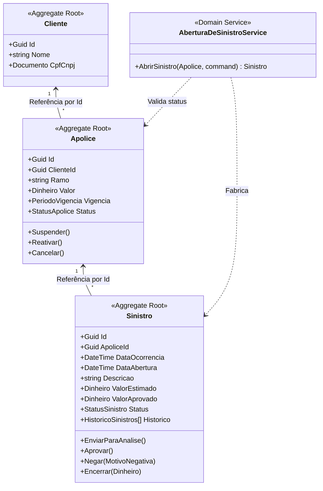

# Gestão de Sinistros (Desafio Segfy)

[](https://github.com/wendellsantos2/segfy_desafio/actions/workflows/ci.yml)

Sistema completo para gestão de apólices e sinistros, desenvolvido com **Domain-Driven Design (DDD)**, **CQRS**, e arquitetura limpa em **.NET 8**, acompanhado de um frontend reativo em **React (Vite + TailwindCSS + TanStack Query)**.

## 🚀 Como Executar (Docker)

A maneira mais fácil de rodar todo o sistema é usando Docker. O projeto contém um `docker-compose.yml` que provisiona o banco de dados PostgreSQL, a API (Backend) e a aplicação React (Frontend) pronta para uso.

```bash
# Clone o repositório
git clone https://github.com/wendellsantos2/segfy_desafio.git
cd segfy_desafio

# Suba os containers em background
docker compose up -d
```

- **Frontend (Web):** http://localhost:5173
- **Backend API (Swagger):** http://localhost:5113/swagger
- **Banco de Dados:** localhost:5433 (PostgreSQL)

> *As migrações do banco de dados e a carga inicial de dados (seeding) de Clientes e Apólices são executadas automaticamente ao iniciar a API.*

---

## 🏗️ Modelo de Domínio

O domínio foi modelado utilizando as melhores práticas do **DDD**. Abaixo está a representação visual dos Aggregate Roots (Raízes de Agregado) e da Máquina de Estados do Sinistro.



---

## 🧩 Padrões DDD Aplicados

Neste projeto, a complexidade de negócios está isolada na camada `Sinistros.Domain`.

- **Aggregate Root:** `Cliente`, `Apolice` e `Sinistro`. Eles garantem a consistência transacional e protegem seus próprios estados.
- **Value Objects:** `Dinheiro`, `PeriodoVigencia`, `Documento` e `MotivoNegativa`. Eles não possuem identidade e encapsulam lógicas de validação (ex: dinheiro não pode ser negativo, período de vigência requer início menor que fim).
- **Domain Service:** `AberturaDeSinistroService`. Utilizado pois a regra "Um sinistro só pode ser aberto se a apólice correspondente estiver Ativa" envolve dois Agregados distintos (`Apolice` e `Sinistro`), não sendo responsabilidade exclusiva de nenhum deles.
- **Repository por AR:** `ISinistroRepository`, `IApoliceRepository`. Cada interface lida com a persistência exclusivamente a partir de uma raiz de agregado.
- **Unit of Work:** Interface `IUnitOfWork` (injetada no CQRS) que garante que a persistência das entidades e o disparo dos eventos ocorram na mesma transação de banco.
- **Linguagem Ubíqua:** Termos como "Apólice Suspensa", "Sinistro em Análise", "Motivo de Negativa", refletem exatamente a linguagem de negócios do ramo de seguros diretamente nos nomes das classes e métodos.

## 📦 Bounded Context
A aplicação representa um único **Bounded Context**: **Gestão de Sinistros**. 
*Se este sistema crescesse para um cenário corporativo real*, eu separaria o contexto de **Subscrição/Emissão** (onde a apólice nasce e é gerenciada) do contexto de **Regulação de Sinistros** (onde a apólice é apenas *read-only* e os sinistros são avaliados). Nesse caso, eles se comunicariam por Eventos de Integração (Kafka/RabbitMQ) e não compartilharíamos o mesmo banco de dados.

---

## ⚖️ Decisões Arquiteturais e Ambiguidades

Ao longo do desenvolvimento, tomei algumas decisões perante os requisitos:

1. **Ações Negadas:** O enunciado não especificava de *onde* um sinistro poderia ser negado. Decidi pela lógica de que ele só pode ser Negado enquanto estiver `Aberto` ou `EmAnalise`. Um sinistro já `Aprovado` não pode retroceder para `Negado`.
2. **Filtros de Data:** O enunciado pedia para listar os sinistros filtrando por "data". Como o sinistro possui `DataOcorrencia`, `DataAbertura` e `DataEncerramento`, optei por usar a `DataAbertura` como padrão para os filtros do endpoint `GET /api/sinistros`, adicionando o parâmetro opcional `campoData` (podendo ser *abertura* ou *ocorrencia*) caso o cliente queira especificar.
3. **Pluralização em Tabelas:** O enunciado mencionou a tabela `HistoricoSinistros` no plural. Para manter coerência, o EF Core foi mapeado explicitamente para utilizar a nomenclatura solicitada no plural para as entidades do domínio.
4. **Front-end Opcional:** Como "plus", construí o frontend para orquestrar as APIs com regras de UX e chamadas Axios lidando com a especificação RFC 7807 (ProblemDetails).

---

## 🔄 Trade-offs

- **Por que DDD numa aplicação de escopo reduzido?**
  Para demonstrar conhecimento arquitetural profundo. Embora CRUDs simples (como Clientes, neste caso) não demandem DDD, a *máquina de estados do Sinistro* justifica totalmente a modelagem rica e proteção de invariantes propostos pelo DDD.
- **Por que MediatR?**
  Para isolar os Controllers (que só conhecem HTTP e DTOs) dos Casos de Uso (Commands/Queries), garantindo que a aplicação seja agnóstica à Web. Isso facilita a futura implementação de *Background Services* ou *Mensageria* que precisem reaproveitar os mesmos casos de uso.
- **Por que ProblemDetails (RFC 7807)?**
  O uso de `IExceptionHandler` com `ProblemDetails` padroniza os erros da API. O frontend não precisa "adivinhar" o que deu errado; ele lê a propriedade `Detail` do erro 422 para mostrar ao usuário alertas amigáveis sobre regras de negócios violadas, sem vazar a stacktrace do C#.

---

## 🧪 Testes e Cobertura

O domínio foi coberto por testes unitários usando **xUnit**, **Moq** e **FluentAssertions**, visando 100% de cobertura nos Value Objects e Entidades.

**Como rodar:**
```bash
cd Sinistros.Tests
dotnet test
```

Os testes cobrem:
- Validações rígidas dos Value Objects (Dinheiro, Período, Motivo, Documento).
- Regras de transição da máquina de estados do Sinistro.
- Regra do `AberturaDeSinistroService` com mocks de repositórios.

---

## ⏳ O que eu faria com mais tempo?

1. **Autenticação e Autorização:** Implementar JWT e RBAC, separando perfis de "Corretor" (pode abrir sinistros) e "Analista" (pode aprovar/negar).
2. **Outbox Pattern:** O disparo de `DomainEvents` atual é sincrono (In-Memory pelo MediatR). Com mais tempo, eu salvaria os eventos numa tabela *Outbox* na mesma transação de banco e usaria um worker process (ex: Quartz.NET) para publicá-los, garantindo resiliência (*At-Least-Once delivery*).
3. **Testes de Integração:** Adicionar testes de integração (E2E) subindo a aplicação em memória com `WebApplicationFactory` e `Testcontainers` para testar os endpoints passando por banco de dados real sem mocks.
